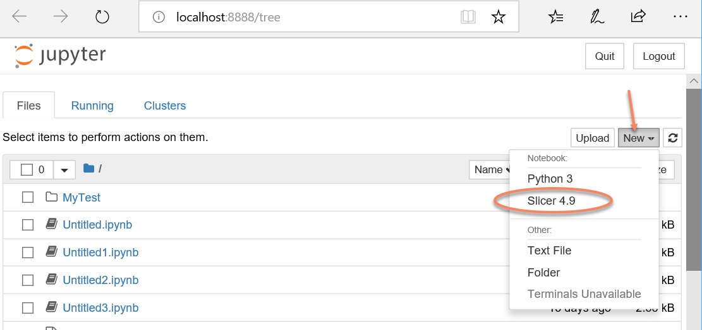

# SlicerJupyter
Extension for 3D Slicer that allows the application to be used from Jupyter notebook

*This project is under active development. Its content, API and behavior may change at any time. We mean it.*

# Usage

## Option 1. Run using Binder

No installation or setup is needed, just click the link below and start using Slicer via Jupyter notebook in your web browser.

[](https://mybinder.org/v2/gh/slicer/SlicerNotebooks/master)

Whn you click on the link, Binder launches 3D Slicer with SlicerJupyter extension on their cloud servers. Binder is a free service and server resources are quite limited. Also, there is no interactive access to the graphical user interface. Therefore, this option is only recommended for testing, demos, or simple computations or visualizations.

## Option 2. Run Slicer and Jupyter on your own computer

### Setup

* Install Python and Jupyter notebook
* Install 3D Slicer and SlicerJupyter extension, restart Slicer
* Switch to JupyterKernel module, select _Python Scripts folder_. This is the folder where _jupyter-kernelspec_ executable is located. On Windows by default it is a location such as _c:\Users\(username)\AppData\Local\Programs\Python\Python37-32\Scripts_. If you use virtual environment, specify Script folder of your virtual environment.
* Click _Install Slicer kernel in Jupyter_ to create kernel and automatically install it.
* Start Jupyter notebook. For example, by runnning _jupyter-notebook_ executable.

Note: If virtual environments or not Python.org distribution (e.g., Anaconda) is used then kernel might need be installed manually using this command (replace <kernelfolder> with the path shown in Slicer in JupyterKernel module as "Slicer kernel folder"):

    jupyter-kernelspec install <kernelfolder>

## Using Slicer from a notebook

* Create a new notebook, selecting _Slicer 4.x_ kernel (for example, _Slicer 4.9_). Jupyter will open a new Slicer instance automatically when kernel start is requested; and this instance will be closed when kernel shutdown is requested.



* While the kernel is starting, "Kernel starting, please wait.." message is displayed. After a few ten seconds Slicer kernel should start.
* Add `display()` at the end of a cell to display Slicer viewer content in the notebook.

## Example

Load a sample data and show an axial slice view:

<pre>
slicer.mrmlScene.Clear(False)
import SampleData
sampleDataLogic = SampleData.SampleDataLogic()
volume = sampleDataLogic.downloadCTChest()
slicer.app.layoutManager().setLayout(slicer.vtkMRMLLayoutNode.SlicerLayoutOneUpRedSliceView)
display()
</pre>

Create a surface mesh from the image:

<pre>
parameters = {}
parameters["InputVolume"] = volume.GetID()
parameters["Threshold"] = 220
outModel = slicer.vtkMRMLModelNode()
slicer.mrmlScene.AddNode( outModel )
parameters["OutputGeometry"] = outModel.GetID()
grayMaker = slicer.modules.grayscalemodelmaker
slicer.cli.runSync(grayMaker, None, parameters)
slicer.app.layoutManager().setLayout(slicer.vtkMRMLLayoutNode.SlicerLayoutOneUp3DView)
slicer.app.layoutManager().threeDWidget(0).threeDView().resetCamera()
display()
</pre>

# Known limitations

- Inspect (Shift-Tab) is not implemented yet

# For developers

## Build instructions

* Build the extension against the newly built Slicer with Qt5 and VTK9 enabled.

* Install Jupyter

```
mkvirtualenv -p python3.5 jupyter_env  # Create and activare virtual environment

pip install jupyter
```

* Install kernel

```
jupyter-kernelspec install /tmp/SlicerJupyter-build/inner-build/share/Slicer-4.9/qt-loadable-modules/JupyterKernel/Slicer-4.9/ --replace --user
```

* Start notebook

```
workon jupyter_env
python -m jupyter notebook
```

## Special commands

These commands must be the last commands in a cell.

- `__kernel_debug_enable()`: enable detailed logging of all incoming Jupyter requests
- `__kernel_debug_disable()`: enable detailed logging of all incoming Jupyter requests
