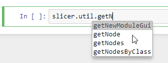
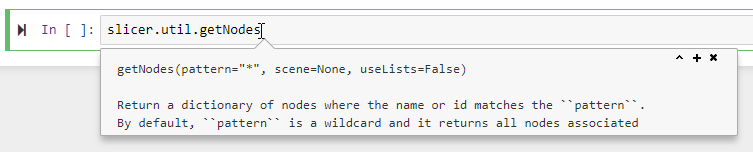

# SlicerJupyter
Extension for 3D Slicer that allows the application to be used from Jupyter notebook

Demo video: https://youtu.be/oZ3_cRXX2QM

[](https://www.youtube.com/watch?v=oZ3_cRXX2QM "Slicer Jupyter kernel demo")

# Usage

## Option 1. Run using Binder

You can use this option for a quick start. No installation or setup is needed, just click the link below and start using Slicer via Jupyter notebook in your web browser.

[](https://mybinder.org/v2/gh/Slicer/SlicerNotebooks/master)

When you click on the link, Binder launches 3D Slicer with SlicerJupyter extension on their cloud servers. Binder is a free service and server resources are quite limited. Also, there is no interactive access to the graphical user interface. Therefore, this option is only recommended for testing, demos, or simple computations or visualizations.

## Option 2. Run on your own computer

* Install [3D Slicer](https://download.slicer.org/) and launch it
* Install `SlicerJupyter` extension in Extension Manager (in the application menu choose View/Extension Manager, click Install button of SlicerJupyter, wait for the installation to complete, and click `Restart`)
* Switch to `JupyterKernel` module (open the module finder by click the "Search" icon on the toolbar, or hitting Ctrl/Cmd-F, then type its name)
* Click `Start Jupyter server` button

### Run classic notebook interface

Follow all the installation steps above (start Jupyter server once with the default JupyterLab user interface), then restart Slicer. After this, a classic notebook server can be started by typing this into the Python console in Slicer:

```
slicer.util._executePythonModule('notebook',['--notebook-dir', 'some/path/to/workspace'])
```

### Using external Jupyter server

Slicer's Python kernel can be used in Jupyter servers in external Python environments. Kernel specification installation command is displayed in `Jupyter server in external Python environment` section in `JupyterKernel` module.

You need to install and set up these Python packages: `jupyter jupyterlab ipywidgets pandas ipyevents ipycanvas`.

## Option 3. Run using docker on your computer

- Install [docker](https://www.docker.com/)
- Run the docker image as described [here](https://github.com/Slicer/SlicerDocker/blob/master/README.rst#usage-of-slicer-notebook-image)

# Using Slicer from a notebook

* Create a new notebook, selecting _Slicer 4.x_ kernel (for example, _Slicer 4.13_). Jupyter will open a new Slicer instance automatically when kernel start is requested. This Slicer instance will be automatically closed when kernel is shut down. If you manually close the Slicer application (e.g., File/Exit menu is used in Slicer) then Jupyter will automaticall restart the application in a few seconds.


* While the kernel is starting, "Kernel starting, please wait.." message is displayed. After maximum few ten seconds Slicer kernel should start.
* Do a quick test - show views content in the notebook:

```
import JupyterNotebooksLib as slicernb
slicernb.ViewDisplay()
```

* Try the interactive view widget:

```
slicernb.ViewInteractiveWidget()
```

* Hit `Tab` key for auto-complete
* Hit `Shift`+`Tab` for showing documentation for a method (hit multiple times to show more details). Note: method name must be complete (you can use `Tab` key to complete the name) and the cursor must be inside the name or right after it (not in the parentheses). For example, type `slicer.util.getNode` and hit `Shift`+`Tab`.





## Notes

### Upgrading pip

You may see warning messages about upgrading pip, such as this:

```
WARNING: You are using pip version 20.1.1; however, version 20.3.3 is available.
You should consider upgrading via the '/Applications/Slicer.app/Contents/bin/./python-real -m pip install --upgrade pip' command.
```

In general, it is not necessary to upgrade pip, so you can ignore this warning. If you do want to upgrade it then you need to use the Slicer's "Python launcher" (instead of python-real). Slicer's Python launcher is called `PythonSlicer` and it sets up Slicer's virtual Python environment so that the real Python executable (python-real) can run correctly.

### Script not on PATH

You may get warning about installing scripts in folder that is not on PATH:

```
WARNING: The script pyjson5 is installed in ‘/Applications/Slicer.app/Contents/lib/Python/bin’ which is not on PATH.
```

This warning is displayed to warn you that the installed script will not run by simply typing its name anywhere in a terminal. This can be safely ignored.

### Shutdown all Slicer Jupyter kernels

If a Jupyter server is kept running then it will automatically restart all kernel instances (Slicer applications) that it manages.
If the browser window is accidentally closed before shutting down the server, then you can get the address of all running servers by typing the following into any Slicer Python console:

```
slicer.util._executePythonModule('jupyter', ['notebook', 'list'])
```

Open the address in a web browser and click "Quit" button to shutdown the server.

# Examples

You can get started by looking at [example Slicer notebooks here](https://github.com/Slicer/SlicerNotebooks).

# For developers

## Build instructions

- [Build 3D Slicer](https://slicer.readthedocs.io/en/latest/developer_guide/build_instructions/index.html)
- Configure this project using CMake, set `Slicer_DIR` CMake variable to the `.../Slicer-build`
- Install prerequisites

## Install kernel manually

Example:

```
jupyter-kernelspec install /tmp/SlicerJupyter-build/inner-build/share/Slicer-4.13/qt-loadable-modules/JupyterKernel/Slicer-4.13/ --replace --user
```

## Launch a kernel manually

Type this into Slicer's Python console to manually start a kernel that a notebook can connect to:

```python
connection_file=r'C:\Users\andra\AppData\Roaming\jupyter\runtime\kernel-3100f53f-3433-40f9-8978-c72ed8f88515.json'
print('Jupyter connection file: ['+connection_file+']')
slicer.modules.jupyterkernel.startKernel(connection_file)
```

Path of `connection_file` is printed on jupyter notebook's terminal window.

## Special commands

These commands must be the last commands in a cell.

- `__kernel_debug_enable()`: enable detailed logging of all incoming Jupyter requests
- `__kernel_debug_disable()`: enable detailed logging of all incoming Jupyter requests
